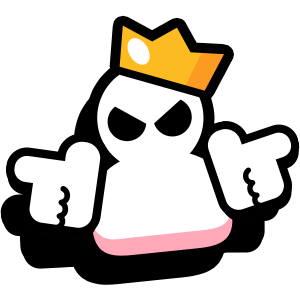

<a name="readme-top"></a>

[![Contributors][contributors-shield]][contributors-url]
[![Forks][forks-shield]][forks-url]
[![Stargazers][stars-shield]][stars-url]
[![Issues][issues-shield]][issues-url]
[![LinkedIn][linkedin-shield]][linkedin-url]

<!-- PROJECT LOGO -->
<br />
<div align="center">
  <a href="https://github.com/greg-hosking/brawl-stars-master-api">
    
  </a>

  <h3 align="center">Brawl Stars Master API</h3>
  
  <p align="center">
    A custom API built to power Brawl Stars Master!
    <br />
    <br />
    <a href="https://github.com/greg-hosking/brawl-stars-master-api/issues">Report Bug</a>
    ·
    <a href="https://github.com/greg-hosking/brawl-stars-master-api/issues">Request Feature</a>
  </p>
</div>


<!-- TABLE OF CONTENTS -->
<details>
  <summary>Table of Contents</summary>
  <ol>
    <li>
      <a href="#about-the-project">About The Project</a>
      <ul>
        <li><a href="#built-with">Built With</a></li>
      </ul>
    </li>
    <li>
      <a href="#getting-started">Getting Started</a>
      <ul>
        <li><a href="#prerequisites">Prerequisites</a></li>
        <li><a href="#installation">Installation</a></li>
      </ul>
    </li>
    <li><a href="#usage">Usage</a></li>
    <li><a href="#roadmap">Roadmap</a></li>
    <li><a href="#contributing">Contributing</a></li>
    <li><a href="#license">License</a></li>
    <li><a href="#contact">Contact</a></li>
    <li><a href="#acknowledgments">Acknowledgments</a></li>
  </ol>
</details>


<!-- ABOUT THE PROJECT -->
## About The Project

When I first started building <a href="https://github.com/greg-hosking/brawl-stars-master">Brawl Stars Master</a>, I was utilizing the <a href="https://developer.brawlstars.com/#/">official Brawl Stars API</a> and the <a href="https://brawlapi.com/#/">Brawlify API</a>. As I worked with these APIs, I encountered pain points for both: the official API provided limited data, and the Brawlify API was not being maintained and had missing or inaccurate data. 

I reached out to Brawl Stars and Brawlify about making contributions to the API, but neither were open source. Then, I looked into what designing and implementing an API myself might look like. I decided on AWS API Gateway due to my familiarity with AWS from a previous internship. I set up a Lambda function to handle incoming GET requests and an S3 bucket to serve as a CDN. With the core functionality in place, all I have left to do is input the rest of the data and assets to complete my first custom API. 


<p align="right">(<a href="#readme-top">back to top</a>)</p>

### Built With

* AWS API Gateway
* AWS Lambda
* AWS S3
* TypeScript

<p align="right">(<a href="#readme-top">back to top</a>)</p>


<!-- USAGE EXAMPLES -->
## Usage

```
GET /brawlers
```

<p align="right">(<a href="#readme-top">back to top</a>)</p>


<!-- ROADMAP -->
## Roadmap

- [ ] /brawlers endpoint
    - [ ] /brawlers/{brawlerID} endpoint
- [ ] /events endpoint

See the [open issues](https://github.com/greg-hosking/brawl-stars-master-api/issues) for a full list of proposed features (and known issues).

<p align="right">(<a href="#readme-top">back to top</a>)</p>


<!-- CONTACT -->
## Contact

Greg Hosking - hoskinggregory@gmail.com

Project Link: [https://github.com/greg-hosking/brawl-stars-unofficial-api](https://github.com/greg-hosking/brawl-stars-master-api)

<p align="right">(<a href="#readme-top">back to top</a>)</p>


<!-- MARKDOWN LINKS & IMAGES -->
<!-- https://www.markdownguide.org/basic-syntax/#reference-style-links -->
[contributors-shield]: https://img.shields.io/github/contributors/greg-hosking/brawl-stars-master-api.svg?style=for-the-badge
[contributors-url]: https://github.com/greg-hosking/brawl-stars-master-api/graphs/contributors
[forks-shield]: https://img.shields.io/github/forks/greg-hosking/brawl-stars-master-api.svg?style=for-the-badge
[forks-url]: https://github.com/greg-hosking/brawl-stars-master-api/network/members
[stars-shield]: https://img.shields.io/github/stars/greg-hosking/brawl-stars-master-api.svg?style=for-the-badge
[stars-url]: https://github.com/greg-hosking/brawl-stars-master-api/stargazers
[issues-shield]: https://img.shields.io/github/issues/greg-hosking/brawl-stars-master-api.svg?style=for-the-badge
[issues-url]: https://github.com/greg-hosking/brawl-stars-master-api/issues
[linkedin-shield]: https://img.shields.io/badge/-LinkedIn-black.svg?style=for-the-badge&logo=linkedin&colorB=555
[linkedin-url]: https://linkedin.com/in/greg-hosking
